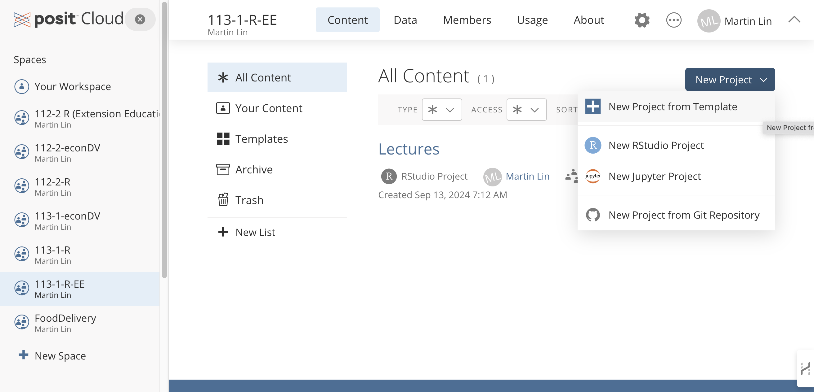
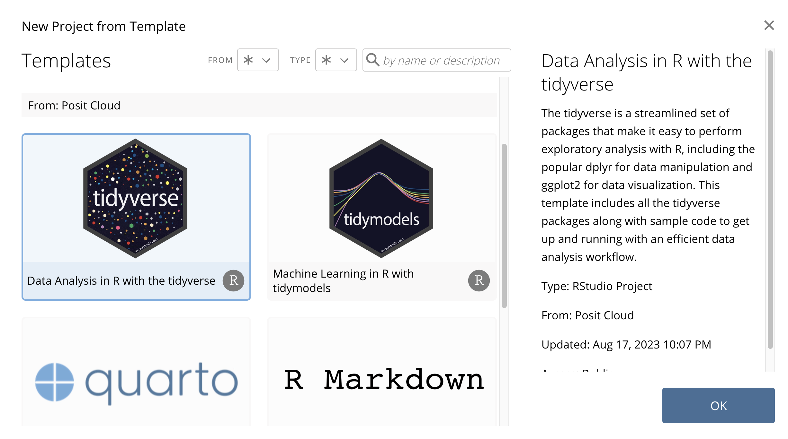
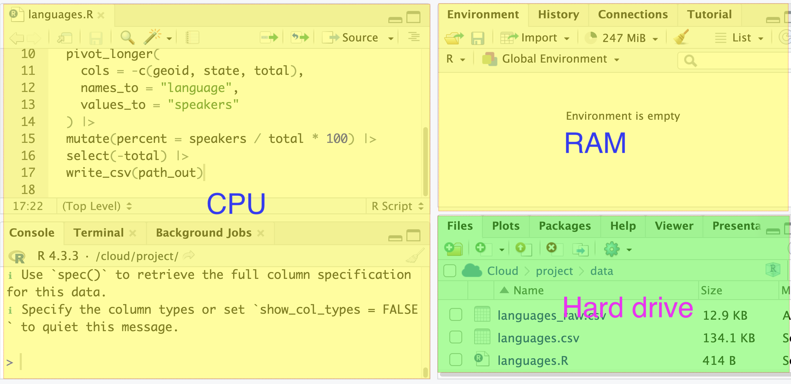

# Computer

## Hard drive

Hard drive is a storage device that stores data. It is non-volatile, meaning that it retains data even when the computer is turned off. It is also slow compared to other storage devices.

## CPU and RAM

CPU (Central Processing Unit) is the brain of the computer. It executes instructions and performs calculations. RAM (Random Access Memory) is a temporary storage device that stores data that the CPU is currently working on. It is faster than the hard drive but slower than the CPU cache.

## Cloud

Cloud can be thought of as some computer that is not physically present, i.e. remote -- not local to you.

> POSIT Cloud is a remote computer that is designed to focus on R progarmming. It preload RStudio (which is an IDE for R) and R language. 
>
> IDE stands for Integrated Development Environment (整合開發環境)

# How does computer program work

## RStudio in POSIT

We will see which part of IDE resembles the brain, and which part resembles the hard drive in the pocket.

## Create a project in POSIT

  1. Choose your workspace  
  2. Click "New Project". 
  3. Choose "New project from Template"
 

  4. Chose "Data Analysis in R with Tidyverse" template

> Once the project is created, you can continue to use it. No need to create another project to run R next time.

## RStudio interface

CPU part: the part that can think and take action based on your command.  

RAM part: the part that when some work for CPU need to remember something, it will store it here.

> What program can do to data is only limited those that our brain can access. 

> When the data is inside the pocket (hard drive), the CPU can't access it directly. It needs to be in the RAM for the CPU to work on it. 

## Import data

If your data is in your hard drive, you need to import it to the RAM so that the CPU can work on it.

# AI preset

For AI to assist you the best, try to provide as much information as possible regarding your computer programming environment. 

> You are using RStudio to conduct R programming tasks in POSIT remote server with preloaded tidyverse package. If the task is programming related, the programming style should follow tidyverse style as closely as possible, i.e. if certain task can be done in both base R and tidyverse, use tidyverse.

## Exercise

Try to download a `.csv` file from [Taiwan open data](https://data.gov.tw/) and import it to RStudio. Ask AI to help you.

