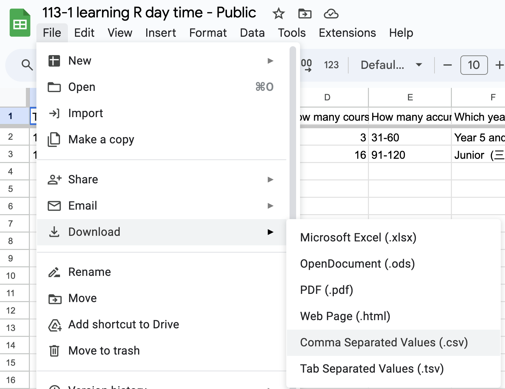

# Tidy Variable Classes

## Example 

 - <https://docs.google.com/spreadsheets/d/1R8KcVs3VxG9V5yoDOex7g8b03m3DgZww845zUu3pGfM/edit?usp=sharing>



Import the data as `survey` data frame, then run the following code.

```r
tidy_survey <- survey %>%
  rename(
    timestamp = `Timestamp`,
    gender = `Gender`,
    has_job = `Do you have a job?`,
    credits_taken = `How many course credits do you take in this semester?`,
    total_credits = `How many accumulative course credits have you acquired so far?`,
    year = `Which year are you in?`,
    programming_languages = `Have you learnt any of the following programming language(s)?`,
    registration_reason = `The reason you register at this course`
  )
```

> The code above is obtained through the following prompt:
> https://github.com/tpemartin/113-1-R/blob/1d40e207fccb9f22f2c84a77ef08823bb9491897/chat/survey-rename.txt#L14-L23


## Factor  

  - a factor variable is a categorical variable.
  - available categories are called **levels**.  
  
> :computer: You can use `levels()` to check the levels of a **factor class** variable.
> :computer: For a **character class** variable, you can use `unique()` to find out all possible values.

> :exclamation: If you don't provide levels, R will automatically generate levels based on the data.  

### Exercise

Which variables in `tidy_survey` are factor variables? How do you ask ChatGPT to parse them into factor?

  
## Ordered factor  

  - an ordered factor is a categorical variable with a specific order.  
  - available categories are called **levels**.  
  
> If you don't provide level sequence, R will automatically generate levels based on the data. (most of time it is wrong.)

> :exclamation: When parsing factor values always specify your level sequence, no matter it is ordered or not.

### Exercise

Which variables in `tidy_survey` are ordered factor variables? How do you ask ChatGPT to parse them into ordered factor?

## Factor levels

  - Can be reordered.  
  - Can be renamed.   
  - Can be grouped.  

### Exercise

  - Reorder the levels of `year` to "Freshman (一年級）", "Sophomore （二年級）", "Junior  (三年級）", "Senior（四年級）", and "Year 5 and above".
  - Rename the levels of `year` into "year 1", "year 2", "year 3", "year 4", and "year 5+".
  - Regroup the levels of  `total_credits` into the following three levels:  
    - "Less than 30", "30 to 90", and "More than 90".

## Numeric Cut
 
  - a numeric variable can be cut into groups, as a ordered factor variable.
  
### Exercise

In `tidy_survey`, cut the `credits_taken` variable into three groups: "Less than 22" and "22 to 24", and "More than 24", and saved under a new variable named `credits_taken_group`.

## Date

  - value must show year, month and day.   
  - different countries have different date formats. For example, in the United States, the date format is MM/DD/YYYY, while in Europe, the date format is DD/MM/YYYY. In Taiwan, it is 西元YYYY年MM月DD日. Therefore, it is important to specify the date format when parsing date variables. 

> Before parsing,  
> If 民國年, you need to add 1911 to each year.
> When asking AI to parse date, always provide the date frequency annually, quarterly, monthly or daily.

> always provide the glimpse result of your data.

### Taiwan Macro database

  - <https://nstatdb.dgbas.gov.tw/dgbasall/webMain.aspx?k=dgmain>

Select a monthly or quarterly dataset, and parse the date variable.

## Datetime 

  - value must show year, month, day, and hour, minute, second, etc. Sometimes it also includes time zone information, such as "2021-10-01 12:00:00+UTC".   
  - if the time zone information is not provided, you need to specify. 


> You can use YYYY, MM, DD, hh, mm, ss, and timezone to specify the format of the datetime variable.


## Exercise

  - fill out the form <https://docs.google.com/forms/d/e/1FAIpQLSc0uF9KFXBRNeRukdPq-T-jQiCUDBAho4-UoyUNsNfLBBrMLw/viewform>  
  - Download the result <https://docs.google.com/spreadsheets/d/1nqjK0V_HHl1R5To8A2-G7p9YQAjfGgSwoawx2WEU4-8/edit?gid=0#gid=0>  
  
Import the data and parse it.