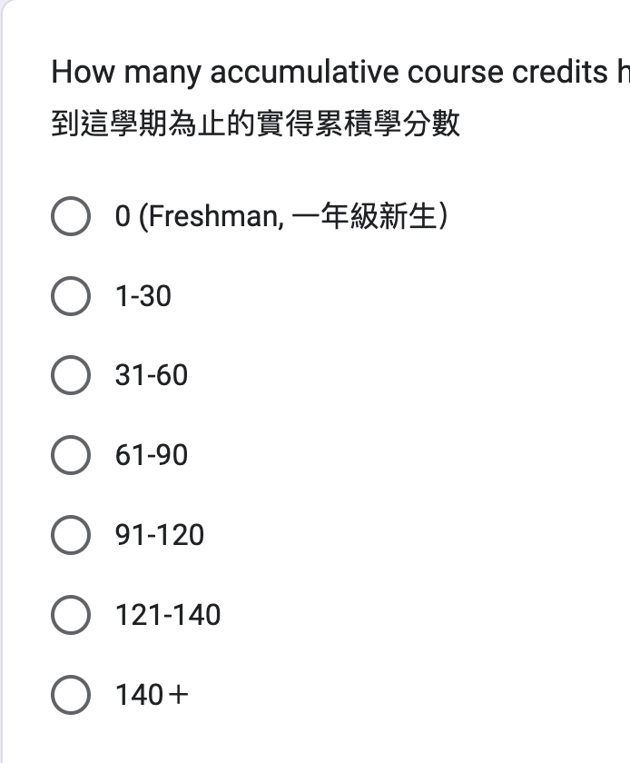

# Tidy Variable Classes

## Example 

 - <https://docs.google.com/spreadsheets/d/1R8KcVs3VxG9V5yoDOex7g8b03m3DgZww845zUu3pGfM/edit?usp=sharing>

<https://github.com/tpemartin/113-1-R/blob/50e305254d1383dfd4def165149ccf6b1588901b/R/week7-recap.R#L1-L18>

```
Rows: 41
Columns: 8
$ timestamp             <chr> "10/16/2024 9:17:30", "10…
$ gender                <chr> "Male", "Male", "Male", "…
$ has_job               <chr> "Full-time job", "Part-ti…
$ course_credits        <dbl> 3, 16, 19, 18, 21, 8, 20,…
$ accum_credits         <chr> "31-60", "91-120", "0 (Fr…
$ year_in_school        <chr> "Year 5 and above", "Juni…
$ programming_languages <chr> "R, Python, JavaScript", …
$ course_reason         <chr> "Interest", "Interest", "…
```

> :computer: For a **character class** variable, you can use `unique()` to find out all possible values.

### Exercise 1

Find out all possible values of the "accum_credits" variable using `unique()`.

<details>
<summary>code</summary> 

<https://github.com/tpemartin/113-1-R/blob/2418956c7e2e6b0e4e8e7f5a81d104c5d0663a78/R/week7-recap.R#L47-L48>  

</details>

### mutate

  - to modify data frame variables. 

`mutate(data frame, ...)`： is a function to modify data frame variables, where ... is a series of `variable = ...` combinations.

## Factor  

  - a factor variable is a categorical variable.
  
## Ordered factor  

  - an ordered factor is a categorical variable with a specific order.  


### Exercise 2

In `tidy_survey1`, which variables should be factor class? Which variables should be ordered factor class? How to ask ChatGPT to get the code to "convert them into factor/ordered factor class"?

<details>

<https://github.com/tpemartin/113-1-R/blob/875cf2e49ac10c1c094e7e0b87f49159523a66fe/R/week6-ee-preparation.R#L9-L14>

</details>

## Levels of Factor/Ordered Factor

Available categories are called **levels**.  

  - use `levels()` to check the levels of a **factor class** variable.
  
### Exercise 3  

  1. Use `levels()` to check the levels of all factor/ordered factor variables in `tidy_survey1`.    
  2. How many levels does `accum_credits` variable has? What are they? Are the levels ordered as the survey question?



<details>

<https://github.com/tpemartin/113-1-R/blob/875cf2e49ac10c1c094e7e0b87f49159523a66fe/R/week6-ee-preparation.R#L17-L19>

</details>

> If you don't provide level sequence, R will automatically design levels based on the data. (most of the time it is wrong.)

> :exclamation: When parsing factor values always specify your level sequence, no matter it is ordered or not.

## Factor levels

### Sepecify levels' order

  - **Can change their order**： Can be reordered.  
  
  >  :exclamation: To change order of levels is to parse the variable again, but this time set `levels=` order. 

### Exercise 4

  - Parse `accum_credits` into an ordered factor with levels' order as "0 (Freshman, 一年級新生）", "1-30", "31-60", "61-90", "91-120", "121-140".  
  - Parse `year_in_school` into an ordered factor with levels' order as "Freshman (一年級）", "Sophomore （二年級）", "Junior  (三年級）", "Senior（四年級）", and "Year 5 and above".  

> :computer: In R, to stack values (also called vector) is put values inside `c()` function with `,` as separator.

<!-- 

### Other manupulations

  - **更改類別名稱**：Can be renamed. (如"18歲以下"改成"0-17")  

  - **合併類別成大類別**：Can be grouped. (如"無工作", "兼職工作者", "全職工作者"改成"無工作", "有工作"兩類) 

> :computer: :exclamation: 針對已經是factor/ordered factor的變數，透過`fct_recode`進行"改類別名稱"或"合併"（合併是多個類別名稱改成相同名稱）。


### Exercise

  1. Parse `年齡`變數成為有"18歲以下", "18-22", "23-30", "31-40", "41+"四個levels的ordered factor。  
  2. Parse `工作狀態`變數成為levels順序為"無工作", "兼職工作者", "全職工作者"的factor。

<details>

<https://github.com/tpemartin/113-1-R/blob/82b3fc39a4f3fe0127ede2d0ab1fc39bd0809104/R/week6-ee-preparation.R#L23-L41>

</details>

### Exercise 

  1. 將`年齡`變數的"18歲以下"改成"0-17"。  
  2. 將`工作狀態`變數的"全職工作"和"兼職工作者"合併成"有工作"。

<details>

<https://github.com/tpemartin/113-1-R/blob/82b3fc39a4f3fe0127ede2d0ab1fc39bd0809104/R/week6-ee-preparation.R#L44-L49>

</details>

## Numeric Cut
 
  - a numeric variable can be cut into groups, as a ordered factor variable.  
  - 被切割的變數會變成ordered factor。
  
### Exercise

將`survey`裡的`一週工時`變數用0, 6, 25, 30, 40, 100切成"0-6", "7-25", "26-30", "31-40", "40+"五個levels的ordered factor。

<details>

<https://github.com/tpemartin/113-1-R/blob/82b3fc39a4f3fe0127ede2d0ab1fc39bd0809104/R/week6-ee-preparation.R#L52-L55>

</details>

## Exercise

引入以下的資料：
  
  - [臺北市政府警察局詐欺案件統計表](https://data.gov.tw/dataset/138892)

將"單位"Parse成factor, 將"發生件數"cut成"低"，"中"，"高"三個levels的ordered factor。

-->