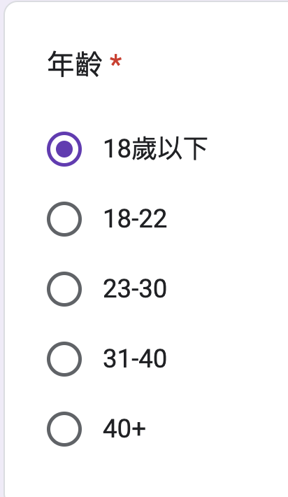

# Tidy Variable Classes


## Example 

 - <https://docs.google.com/spreadsheets/d/1nqjK0V_HHl1R5To8A2-G7p9YQAjfGgSwoawx2WEU4-8/edit?gid=0#gid=0>


<https://github.com/tpemartin/113-1-R/blob/83de67627537dfab152844b98996bf8c2ffaf07f/R/week6-ee-preparation.R#L2-L3>


```
Rows: 17
Columns: 8
$ Timestamp                      <chr> "10/5/2024 10:31:…
$ 性別                           <chr> "男", "男", "男",…
$ 工作狀態                       <chr> "全職工作者", "兼…
$ 年齡                           <chr> "40+", "23-30", "…
$ 接觸過的程式                   <chr> "R, Python, JavaS…
$ 選這門課原因                   <chr> "興趣, 覺得對未來…
$ `課程建議（包含想學什麼課題）` <chr> NA, NA, NA, NA, N…
$ 一週工時                       <dbl> 40, 36, 35, 40, 5…
```

> :computer: For a **character class** variable, you can use `unique()` to find out all possible values.

### Exercise

使用`unique()`找出"年齡"變數（variable）的所有可能值。

<details>

<https://github.com/tpemartin/113-1-R/blob/d4d10bc0a694f8d3eaaaaa012bdf47b026555daf/R/week6-ee-preparation.R#L5>  

</details>

## Factor  

  - a factor variable is a categorical variable.
  
## Ordered factor  

  - an ordered factor is a categorical variable with a specific order.  


### Exercise  

`survey`裡哪些變數應該要是factor class? 那些變數應該是ordered factor class? 該如何要求ChatGPT得到 「將它們轉換成factor/ordered factor class的程式碼」?   

<details>

<https://github.com/tpemartin/113-1-R/blob/875cf2e49ac10c1c094e7e0b87f49159523a66fe/R/week6-ee-preparation.R#L9-L14>

</details>

## Levels of Factor/Ordered Factor

Available categories are called **levels**.  

  - use `levels()` to check the levels of a **factor class** variable.
  
### Exercise   

  1. 使用`levels()`查看所有factor/ordered factor變數的levels。  
  2. `年齡`變數的levels是什麼？有包含問卷所有年齡的可能值嗎（見下圖）？



<details>

<https://github.com/tpemartin/113-1-R/blob/875cf2e49ac10c1c094e7e0b87f49159523a66fe/R/week6-ee-preparation.R#L17-L19>

</details>

> If you don't provide level sequence, R will automatically design levels based on the data. (most of time it is wrong.)

> :exclamation: When parsing factor values always specify your level sequence, no matter it is ordered or not.

## Factor levels

  - **更改呈現順序**： Can be reordered, like previous exercise 2. 
  >  :exclamation: 重新Parse一次，但這次要設定`levels=`順序  

  - **更改類別名稱**：Can be renamed. (如"18歲以下"改成"0-17")  
  - **合併類別成大類別**：Can be grouped. (如"無工作", "兼職工作者", "全職工作者"改成"無工作", "有工作"兩類) 

> :computer: :exclamation: 針對已經是factor/ordered factor的變數，透過`fct_recode`進行"改類別名稱"或"合併"（合併是多個類別名稱改成相同名稱）。


### Exercise

  1. Parse `年齡`變數成為有"18歲以下", "18-22", "23-30", "31-40", "41+"四個levels的ordered factor。  
  2. Parse `工作狀態`變數成為levels順序為"無工作", "兼職工作者", "全職工作者"的factor。

<details>

<https://github.com/tpemartin/113-1-R/blob/82b3fc39a4f3fe0127ede2d0ab1fc39bd0809104/R/week6-ee-preparation.R#L23-L41>

</details>

### Exercise 

  1. 將`年齡`變數的"18歲以下"改成"0-17"。  
  2. 將`工作狀態`變數的"全職工作"和"兼職工作者"合併成"有工作"。

<details>

<https://github.com/tpemartin/113-1-R/blob/82b3fc39a4f3fe0127ede2d0ab1fc39bd0809104/R/week6-ee-preparation.R#L44-L49>

</details>

## Numeric Cut
 
  - a numeric variable can be cut into groups, as a ordered factor variable.  
  - 被切割的變數會變成ordered factor。
  
### Exercise

將`survey`裡的`一週工時`變數用0, 6, 25, 30, 40, 100切成"0-6", "7-25", "26-30", "31-40", "40+"五個levels的ordered factor。

<details>

<https://github.com/tpemartin/113-1-R/blob/82b3fc39a4f3fe0127ede2d0ab1fc39bd0809104/R/week6-ee-preparation.R#L52-L55>

</details>

## Exercise

引入以下的資料：
  
  - [臺北市政府警察局詐欺案件統計表](https://data.gov.tw/dataset/138892)

將"單位"Parse成factor, 將"發生件數"cut成"低"，"中"，"高"三個levels的ordered factor。