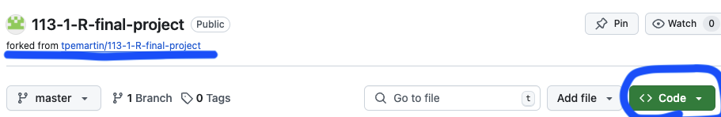
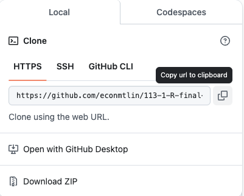
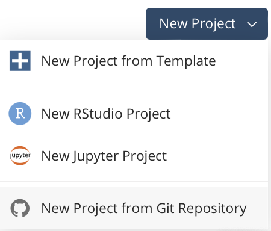
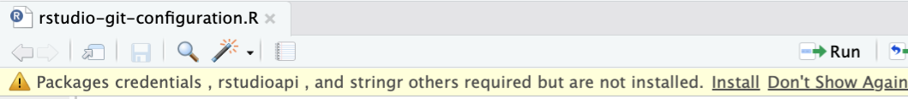
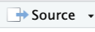
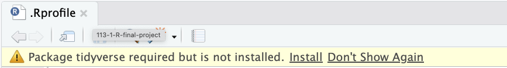
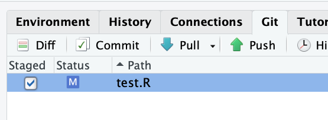
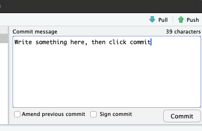

# Git and Github

  - Git: A version control system (VCS) that allows you to track changes in your code.  
  - Github: A platform that store your project files.  

## Why Github?  

- Version control
- Collaboration
- Portfolio
- Showcase your work
- Documentation

## Repository (repo)

Storage for your project files. 

## Use Github in POSIT

Benefits of using Github for POSIT project: 

- :exclamation: enjoy the benefits of version control, and collaboration (good for final project).

### Steps  

  1. Get the link of the repository.  
  2. Start a new project in POSIT with the link.  
  3. Run rstudio-git-configuration.R

### 1. Create a repository

We use fork to create a repository here.

On the following page:

  - <https://github.com/tpemartin/113-1-R-final-project>

Click , then at the next page, click 

### 2. Obtain the link of the repository



  - Make sure the repo title indicate the repo is forked.  
  - Click Code button.

*** 

  


  - Then copy the url link 

### 3. Start a new project in POSIT with the link


 

### 4. Setup github in POSIT

Open **rstudio-git-configuration.R** file. 

Install required packages by click "install".



Click  to setup github.


### Setup tidyverse in POSIT

> This step is not for github setup. It is for final project needs. 

Click open **.Rprofile** file.
Install required packages by click "install".

## How to use Git 

There are basically two steps:
  1. Store changes locally through **commit**.   
  2. Store the committed changes in Github through **push**.

### 1. commit  

At the Git tab in RStudio, you can see the changes you made in your project. Check those changes you want to record and click "commit". 



*** 

Finalize the commit by writing some commit message and hit "commit".




### 2. push

At the Git tab in RStudio, click "push" to store the committed changes in Github.

:exclamation: If push fails, you need to go over [4. Setup github in POSIT](#4-setup-github-in-posit) again.


## Exercise

Add some .R files to the repository and push them to Github.


## `ntpuR` package

```R
install.packages("tidyverse")
```

```R
install.packages("remotes")
```

```R
remotes::install_github("tpemartin/ntpuR")
```

```R
library(ntpuR)
setup_github_personal_access_token()
```

> :exclamation: In the future, when you do "push" in Git and it asks for password, use the token that saved in ".Renviron" file instead. 

## `usethis` package`

  - <https://usethis.r-lib.org/articles/git-credentials.html>