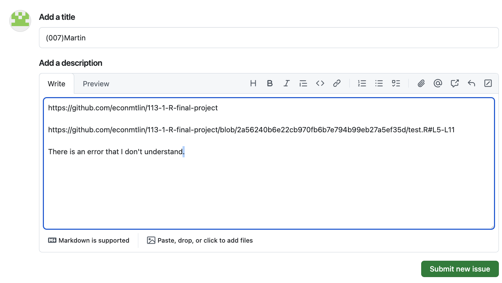
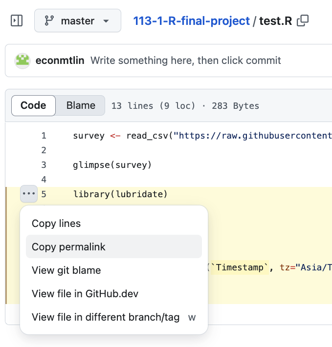

# Final project setup

  - Repository preparation
  - Files preparation  
  - How to Q&A
  
## 1. Repository preparation

Fork the final project repository and create a POSIT project with the link with proper setup. (check [the github lecture note](https://github.com/tpemartin/113-1-R/blob/main/Lecture-notes/08-github.md) for details) 

## 2. Files preparation

You should push codes, data and a text file of your ChatGPT links to the repository.

### Data preparation

  - [Open data Taiwan](https://data.gov.tw/)  
  - [Taiwan Labor Statistics](https://statfy.mol.gov.tw/)  
  - [Taiwan Macro Economic Data](https://nstatdb.dgbas.gov.tw/dgbasall/webmain.aspx?sys=100&funid=defjsp)  

Upload at least on dataset to the repository and commit/push it to the repository.  

### ChatGPT links

Any text file with the links of your ChatGPT conversation will do.

## 3. How to Q&A

Post your question in "Issue" tab in the repository of source final project repository (<https://github.com/tpemartin/113-1-R-final-project>)

  - <https://github.com/tpemartin/113-1-R-final-project/issues>

### For the 1st question

  - **Title** should be "(three digits of your student ID)Name"  
  - Description:  
    - **Final project link** (:exclamation: required).  
    - Code **permalink** (the link that can show me the code lines with problem).
    - Your **question**.
  
### For the following questions

Use the same issue to post your following questions.  

No need to post the final project link again.

