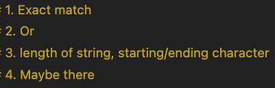

# Character Class (2)

<https://github.com/tpemartin/113-1-R/blob/17c21d027143ffb312b22391221817808e043253/R/week12-ee.R#L1-L60>

## Pattern (REGEX)

### Neghbors (look ahead / look behind)

 -  Preceded by / Not preceded by a neighbor pattern (前面要有 / 前面不能有 鄰居pattern).  
 -  Followed by / Not followed by a neighbor pattern (後面要有 / 後面不能有 鄰居pattern).

#### github username

AI conversation:

<https://github.com/tpemartin/113-1-R/blob/b682de46a38023e0d548afb1fd80d4e5ea081b72/chat/regex-neighor.txt#L23-L37>

 **Code** 

<https://github.com/tpemartin/113-1-R/blob/17c21d027143ffb312b22391221817808e043253/R/week12-ee.R#L62-L68>

> :exclamation: if AI does not use the neighbor regex, you can ask it to use "look ahead" or "look behind" regex.

AI conversation:

<https://github.com/tpemartin/113-1-R/blob/b682de46a38023e0d548afb1fd80d4e5ea081b72/chat/regex-neighor.txt#L55-L68>

#### Taiwan district

AI conversation without neighbor regex:

<https://github.com/tpemartin/113-1-R/blob/b682de46a38023e0d548afb1fd80d4e5ea081b72/chat/regex-neighor.txt#L70-L87>

**Code** without neighbor regex

<https://github.com/tpemartin/113-1-R/blob/17c21d027143ffb312b22391221817808e043253/R/week12-ee.R#L70-L76>

AI conversation with neighbor regex:

<https://github.com/tpemartin/113-1-R/blob/b682de46a38023e0d548afb1fd80d4e5ea081b72/chat/regex-neighor.txt#L89-L107>

**Code** with neighbor regex

<https://github.com/tpemartin/113-1-R/blob/17c21d027143ffb312b22391221817808e043253/R/week12-ee.R#L78-L81>

> :exclamation: Double check `{m, n}` for the number of characters if it includes the character you want to match. 

## Applications

### Customized Emails

  - <https://developers.google.com/apps-script/samples/automations/mail-merge>

### How many words/sentences

### Word boundary

- `\\b`: word boundary.

## JiabaR

## Application

### Customized Emails

#### Gmail merger

  - <https://support.google.com/mail/answer/12921167?hl=en>

#### gmailr

  - <https://github.com/r-lib/gmailr>

