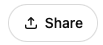
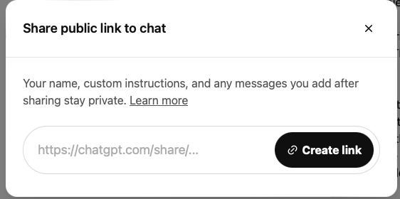
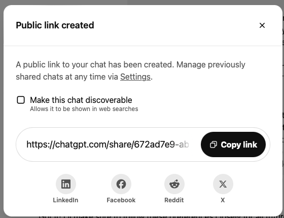
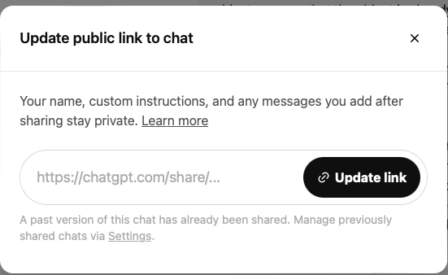

# Appendix: create chatGPT shared link

In a ChatGPT conversation, 

1. Click on the "Share" button .
2. Click on the "Create link" button when see the following pop up:
   
3. Click on the "Copy link" button to copy the link when the following pop up appears:
   

> :exclamation: Any conversation after a shared link is created will not be included in the shared link. You need to do the above steps again to **update** the shared link. The only difference is that the button to click at step 3 will be called "Update link" instead of "Copy link".
> 
> 