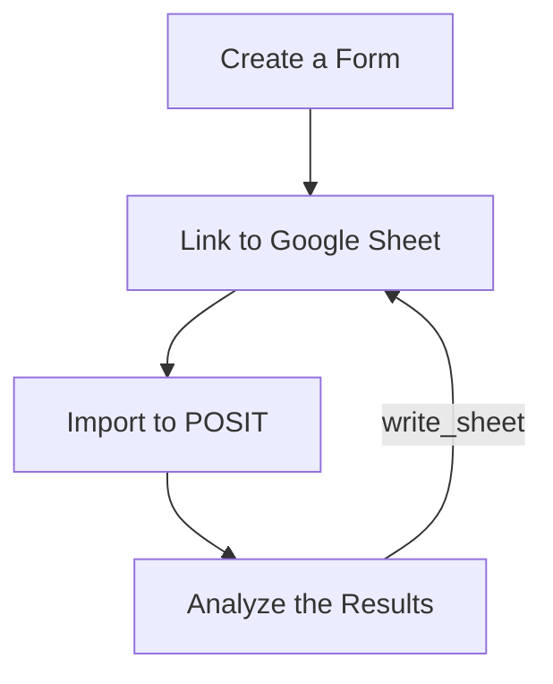
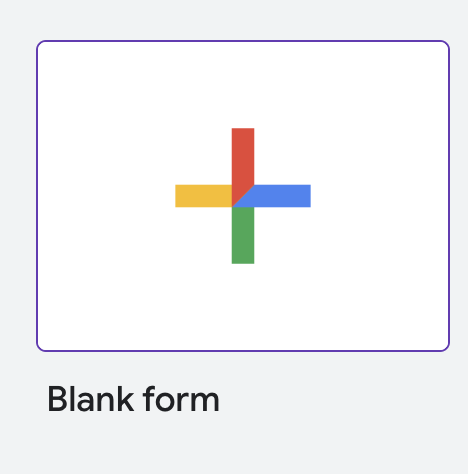
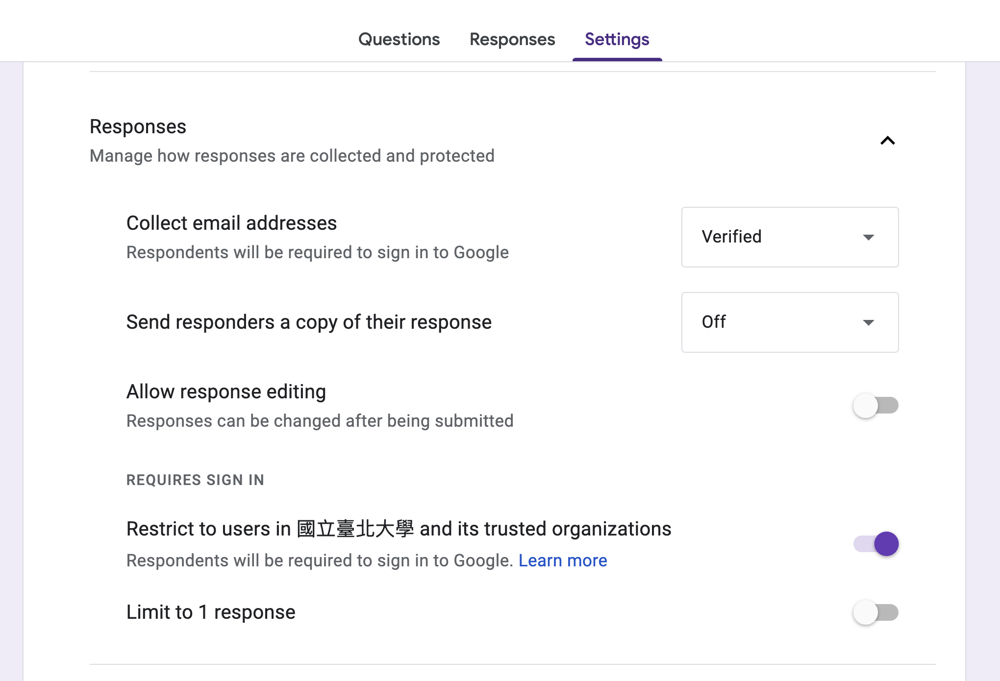
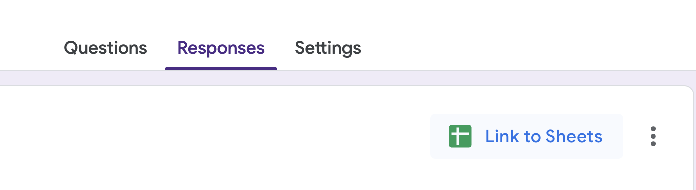

# Google Form and Sheets




## Create a Form




***

Be aware of **Response** setting:



## Link to Google Sheet



## import to POSIT

```r
survey <- googlesheets4::read_sheet("Google Sheet URL",
    sheet="表單名稱")
```


## Analyze the Results

You can post result back to Google sheets: 

```r
googlesheets4::write_sheet(result, 
  "Google Sheet URL",
  sheet="表單名稱")
```

  - `result` is the result data frame you want to post back to Google Sheets.