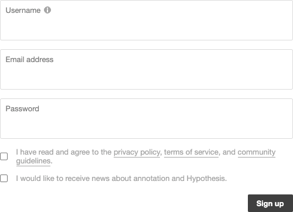
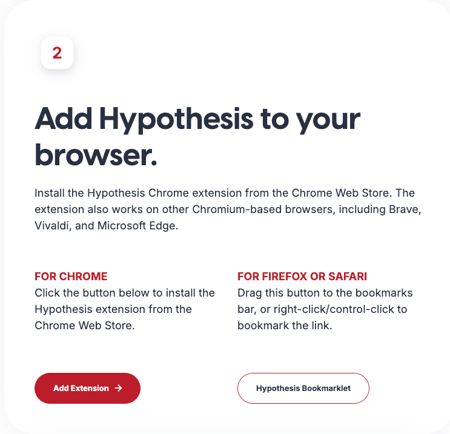
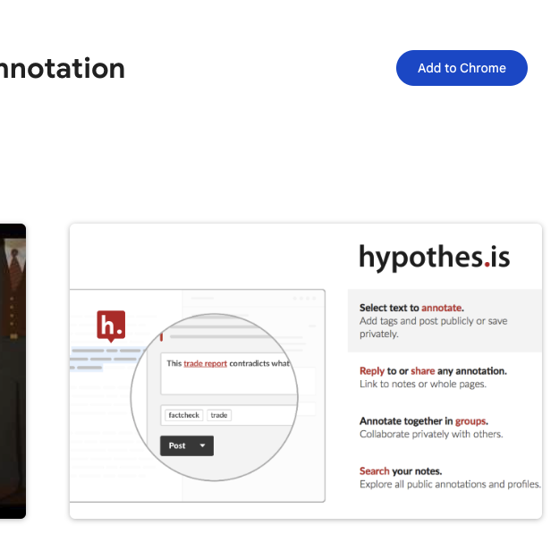

# Appendix: Hypothesis online notebook

A web tool for annotating web pages.

  - <https://web.hypothes.is/start/>

## 1. Sign up

  - Sign up for a free account.

| Step 1 | Step 2 |
|---------|--------------------------------------------| 
|  |  |
|---------|--------------------------------------------|

## 2. Install the browser extension (Chrome)

|  |  |
|---------|--------------------------------------------|
| Browser Extension/Bookmark  |  |

> :exclamation: Pin the extension to the browser toolbar for easy access: <https://hypothes.is/welcome/513864ac83d758a6>

## 3. Annotate

  - <https://web.hypothes.is/help/annotation-basics/>

