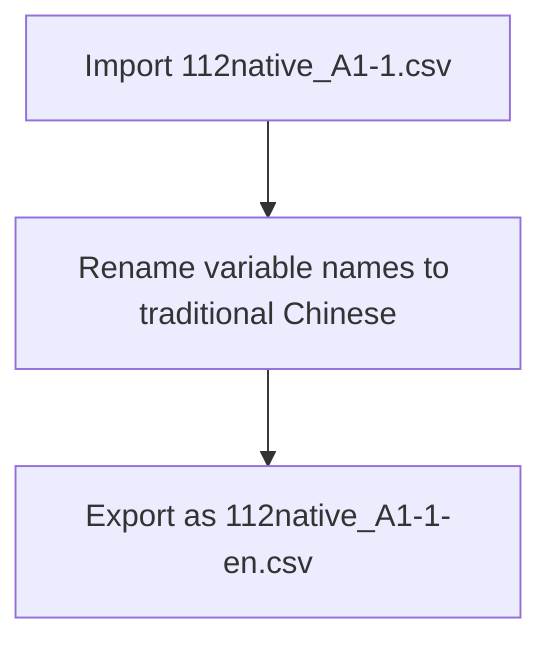
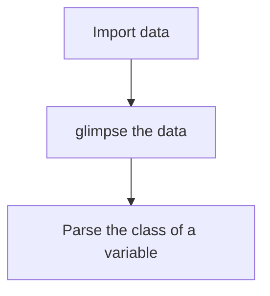

# 1. Task Flow

There is a dataset called `112native_A1-1.csv`. I want to import it, change the variable names to English, and export it to `112native_A1-1-en.csv`.

> Remember one AI prompt guideline is "Divide Task"

## Task flow chart

One way to divide the task is to create a flow chart. 



## Turn the flow chart into divided tasks

1. Import 112native_A1-1.csv as a dataframe called `native`.  
2. Rename variable names to traditional Chinese.  
3. Export the data as a csv file.

> For 2, a suggested prompt is:
>
> In the global environment, there is a dataframe called `native` whose variable names are in Chinese. Rename them to English. The current chinese names are:
[1] "學年度" "學校類別" "學校代碼"
[4] "學校名稱" "在學學生人數_博士班" "在學學生人數_碩士班"
[7] "在學學生人數_學士班" "在學學生人數_二專" "在學學生人數_五專"
[10] "上學年度畢業生人數_博士" "上學年度畢業生人數_碩士" "上學年度畢業生人數_學士"
[13] "上學年度畢業生人數_二專" "上學年度畢業生人數_五專

  - The design of this prompt is consider the AI's memory. The AI does not know the content of the data.

> For 3, a better prompt is:
> Export the dataframe `native` as a csv file called `112native_A1-1-en.csv`.

## Turn the tasks into prompts

Constantly check if your prompt design follows the AI prompt guidelines.


  1. **Clear direction**: Provide a clear and concise description of the task you want to accomplish.
  2. **Provide example**: Provide an example of the input data or code you are working with.  
  3. **Specify output/result format**: Specify the format of the output or result you want to achieve.
  4. **Divide task**: Divide your task into smaller tasks.
  5. **Evaluate quality**: Evaluate the quality of the code provided by the AI assistant.

> Constantly bear in mind what inside AI's brain which is different from your local computer, and is different from the POSIT remote server. 
>
> Only the past chat history is stored in AI's memory. 
>
> AI can not execute your code. It can only provide you with code snippets. Therefore, the content of your data is not available to AI. Unless you clearly specify it in the prompt.


## Program


<https://github.com/tpemartin/113-1-R/blob/d80d1403cbe15ba0bbe6960863f88583a4ed8573/R/week2.R#L1-L29>

# 2. Tidy data

## Tidy variable classes

```r
# Load the tidyverse package
library(tidyverse)

# Create an example data frame with 10 observations
example_df <- tibble(
  Name = c("Alice", "Bob", "Charlie", "Diana", "Ethan", 
           "Fiona", "Greg", "Hannah", "Ian", "Jasmine"),  # Pure character variable
  Date_of_Birth = c("1990-01-01", "1985-06-15", "1992-11-23", 
                    "1988-04-05", "1995-02-28", "1991-12-10", 
                    "1989-07-19", "1993-09-25", "1994-05-15", 
                    "1990-03-30"),  # Character variable with date information
  BloodType = c("A", "B", "O", "AB", "B",  
                "A", "O", "AB", "B", "A"), # Different blood types for each individual
  Score = c(85.5, 92.0, 78.0, 88.5, 95.0, 
            82.0, 76.5, 90.0, 89.5, 84.0),  # Numerical variable
  Passed = c(TRUE, TRUE, FALSE, TRUE, TRUE, 
             FALSE, TRUE, TRUE, FALSE, TRUE)  # Logical variable
)

```

Before we conduct data mining, we need to make sure the variable classes are correct. If not, we need to parse them.



> In the global environment `example_df` is a dataframe. Parse `example_df$Date_of_Birth` as a date variable, and `example_df$BloodType` as a factor variable.

A better prompt is:
> In the global environment `example_df` is a dataframe. A glimpose of the data shows: 
> ```
> Rows: 2
> Columns: 5
> $ Name          <chr> "Alice", "Bob"
> $ Date_of_Birth <chr> "1990-01-01", "1985-06-15"
> $ BloodType     <chr> "A", "B"
> $ Score         <dbl> 85.5, 92.0
> $ Passed        <lgl> TRUE, TRUE
> ```
> Parse `example_df$Date_of_Birth` as a date variable, and `example_df$BloodType` as a factor variable.

  - Different countries have different date formats. For example, in the United States, the date format is MM/DD/YYYY, while in Europe, the date format is DD/MM/YYYY. Therefore, it is important to specify the date format when parsing date variables.
  

> It is a good practice to provide a glimpse of the data to the AI when you mention that data the first time. 