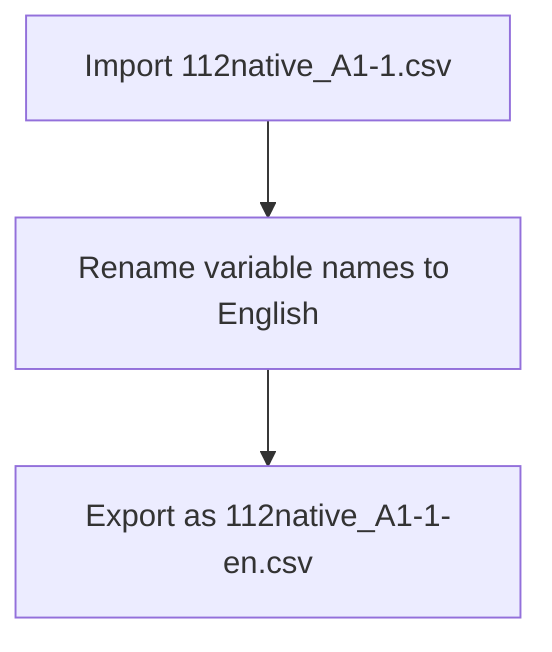

# 1. Task Flow

There is a dataset called `112native_A1-1.csv`. I want to import it, change the variable names to English, and export it to `112native_A1-1-en.csv`.

> Remember one AI prompt guideline is "Divide Task"

## Task flow chart

One way to divide the task is to create a flow chart. 

## Turn the flow chart into divided tasks

1. Import 112native_A1-1.csv as a dataframe called `native`.  
2. Rename variable names to traditional Chinese.  
3. Export the data as a csv file.

> For 2, a suggested prompt is:
>
> In the global environment, there is a dataframe called `native` whose variable names are in Chinese. Rename them to English. The current chinese names are:
[1] "學年度" "學校類別" "學校代碼"
[4] "學校名稱" "在學學生人數_博士班" "在學學生人數_碩士班"
[7] "在學學生人數_學士班" "在學學生人數_二專" "在學學生人數_五專"
[10] "上學年度畢業生人數_博士" "上學年度畢業生人數_碩士" "上學年度畢業生人數_學士"
[13] "上學年度畢業生人數_二專" "上學年度畢業生人數_五專

  - The design of this prompt is consider the AI's memory. The AI does not know the content of the data.

> For 3, a better prompt is:
> Export the dataframe `native` as a csv file called `112native_A1-1-en.csv`.

