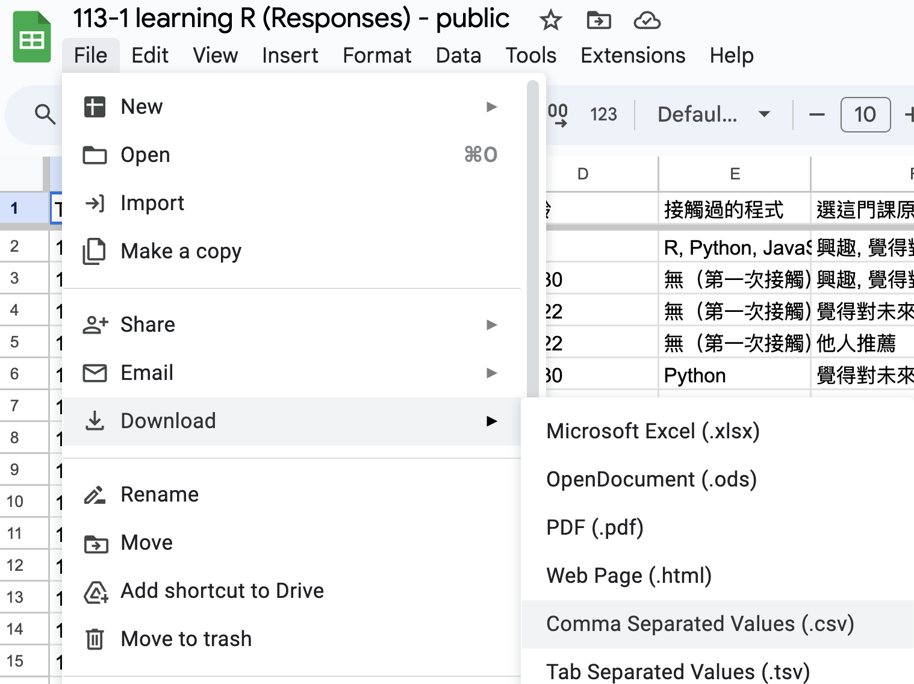

# Recap

## R language

  - `library(tidyverse)`  
  - `read_csv()`;
  - `glimpse()`;
  - `names()`;
  

## Survey

下載[課堂問卷調查結果](https://docs.google.com/spreadsheets/d/1nqjK0V_HHl1R5To8A2-G7p9YQAjfGgSwoawx2WEU4-8/edit?gid=0#gid=0)成為CSV檔案：

  - 引入POSIT成為一個名為`survey`的data frame，看一下資料的樣子(`glimpse`)。  

