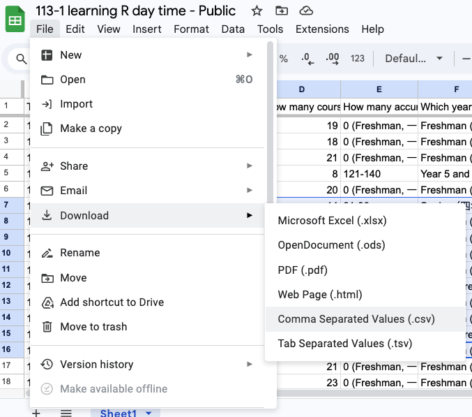

# Recap

  - How to import from Google Sheets  

<https://docs.google.com/spreadsheets/d/1R8KcVs3VxG9V5yoDOex7g8b03m3DgZww845zUu3pGfM/edit?gid=0#gid=0>

## Save as CSV



## Import from CSC

Import and glimpse

<https://github.com/tpemartin/113-1-R/blob/add646ba9b31da9b6f779108adb784d6c1199fe0/R/week7-recap.R#L1-L4>

## Change variable names

<https://github.com/tpemartin/113-1-R/blob/add646ba9b31da9b6f779108adb784d6c1199fe0/R/week7-recap.R#L6-L18>

```
Rows: 41
Columns: 8
$ timestamp             <chr> "10/16/2024 9:17:30", "10…
$ gender                <chr> "Male", "Male", "Male", "…
$ has_job               <chr> "Full-time job", "Part-ti…
$ course_credits        <dbl> 3, 16, 19, 18, 21, 8, 20,…
$ accum_credits         <chr> "31-60", "91-120", "0 (Fr…
$ year_in_school        <chr> "Year 5 and above", "Juni…
$ programming_languages <chr> "R, Python, JavaScript", …
$ course_reason         <chr> "Interest", "Interest", "…
```


## Parsing factor variables

<https://github.com/tpemartin/113-1-R/blob/add646ba9b31da9b6f779108adb784d6c1199fe0/R/week7-recap.R#L20-L26>